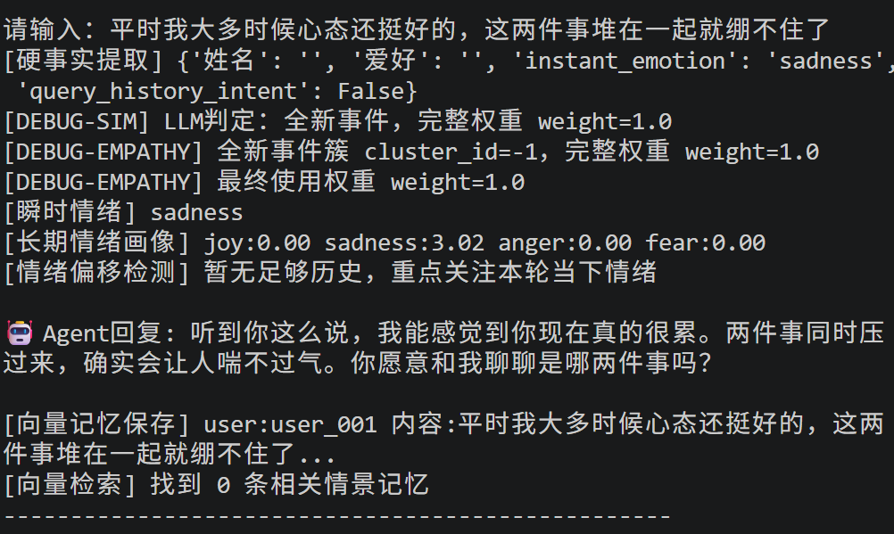
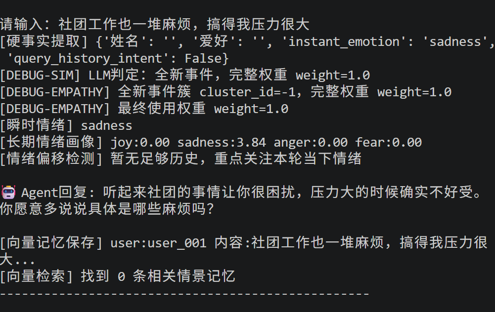
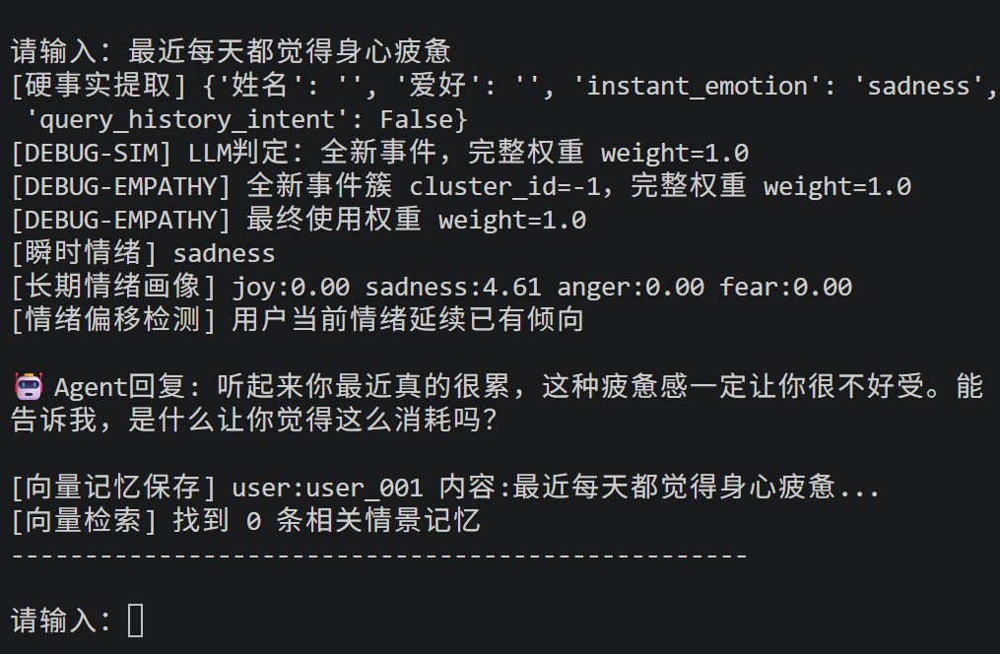
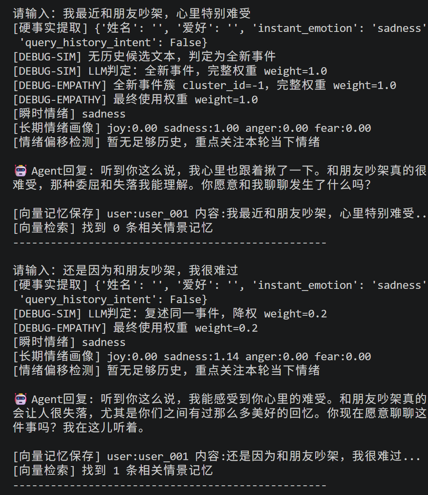
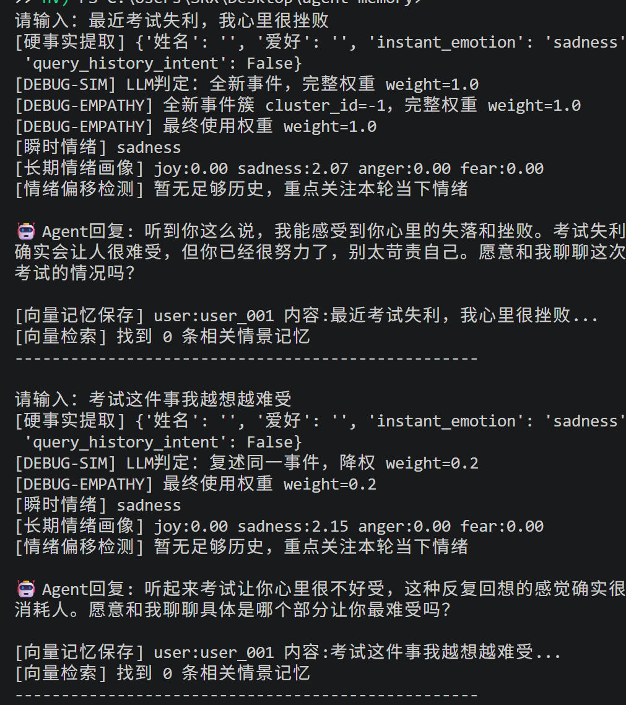
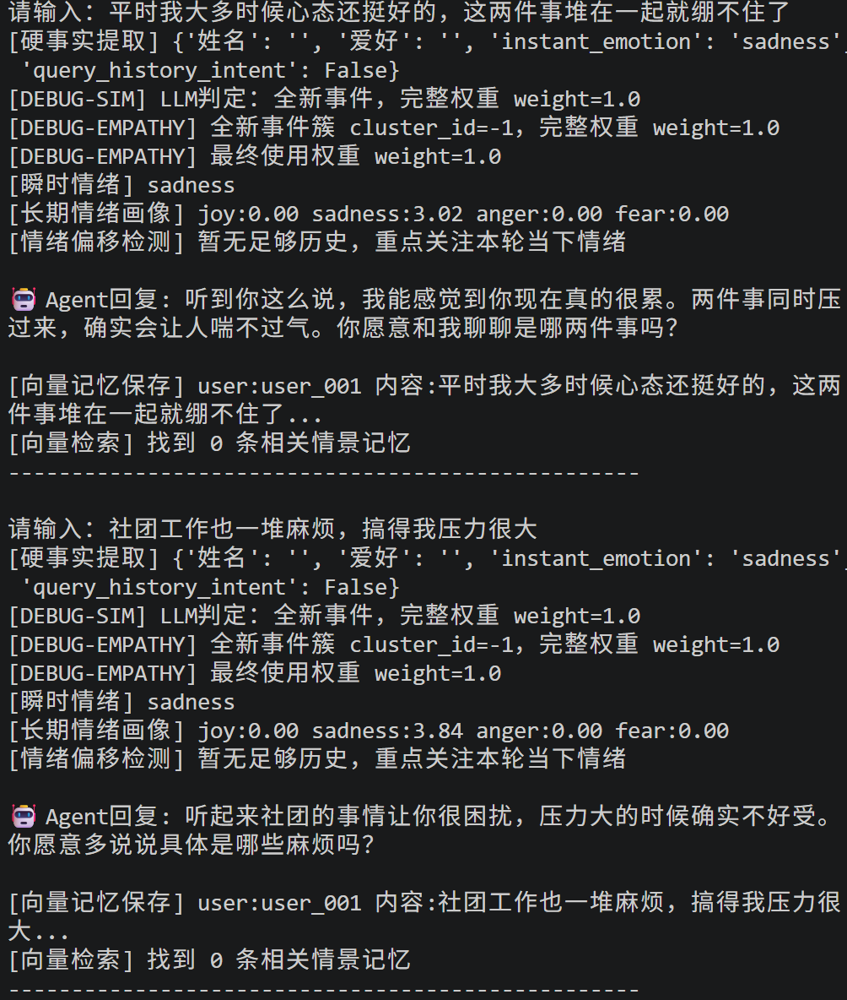
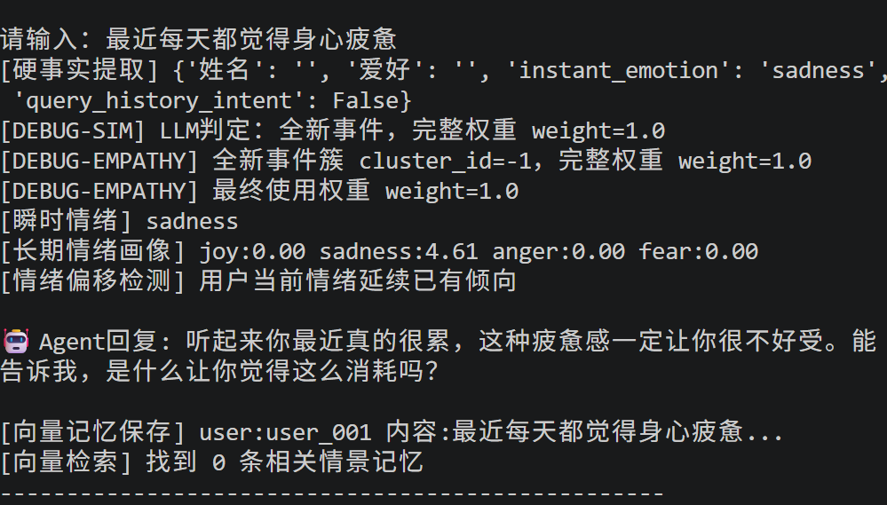
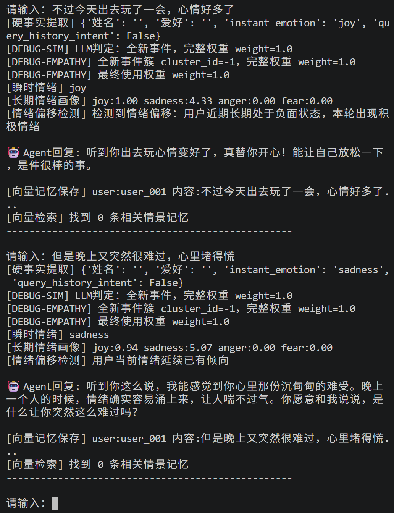
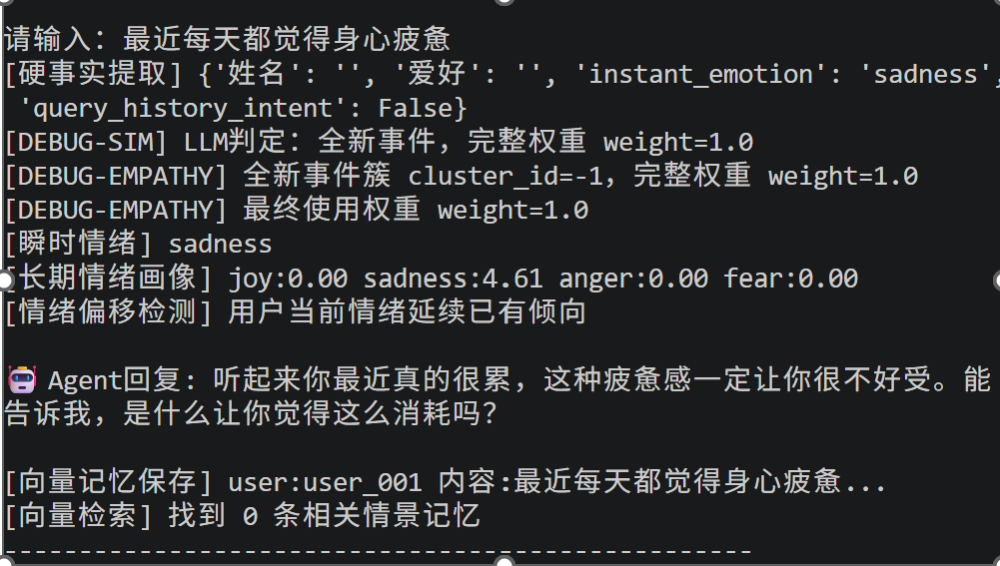

# 基于长期记忆与情绪感知的共情对话Agent
红岩网校AI组作业

## 项目简介
基于 LangGraph 构建对话Agent，设计三层异构记忆架构。
实现事件语义降权、情绪时间衰减、情绪偏移检测、双源事件判别、时序隔离写入，缓解传统大模型记忆失真、情绪固化的问题，模拟人与人长期聊天感知对方性格情绪的效果。

### 三层记忆架构
1. SQLite：存储用户硬事实、结构化情绪画像
2. ChromaDB：情景向量记忆，语义检索历史对话
3. 内存缓冲区：向量检索失效兜底

## 环境依赖
```

langgraph
langchain-openai
chromadb
sentence-transformers
python-dotenv

```

## 配置
根目录新建 `.env` 文件填入密钥：
```env
MODEL_NAME=deepseek-chat
OPENAI_API_KEY=xxx
OPENAI_BASE_URL=https://api.deepseek.com/v1
```

## 运行

```
# 清理旧数据
Remove-Item -Force agent_memory.db,agent_memory.db-shm,agent_memory.db-wal
Remove-Item -Recurse -Force chroma_db

# 启动程序
python graph.py
```

输入 `quit` 退出对话。

## 核心功能

1. **事件降权**：全新事件权重 1.0；同一事件反复倾诉权重 0.2，避免单一事件扭曲用户画像
2. **情绪时间衰减**：衰减系数 0.94，旧情绪随对话逐步弱化
3. **情绪偏移检测**：积累足够基线后，识别情绪延续 / 情绪反常突变
4. **双源兜底判别**：向量召回失败时读取最近对话做事件判断
5. **时序隔离写入**：本轮输入不会被本轮检索读取

## 运行截图










## 测试报告

详细测试分析文档：[report.md](./report.md)


